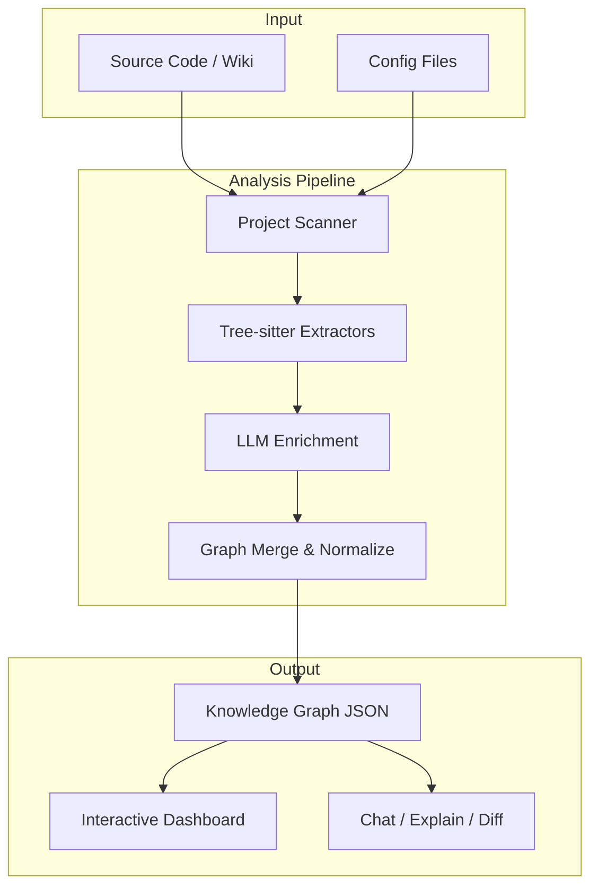
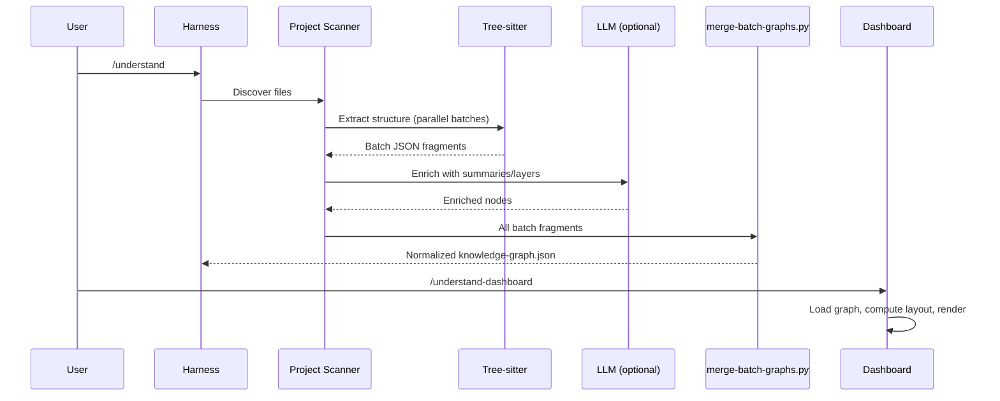

# Architecture

## System Overview

Understand-Anything is a **multi-agent analysis pipeline** with a **plugin-based extraction engine** and an **interactive visualization dashboard**. The system transforms source code into a structured knowledge graph that can be explored visually or queried conversationally.



## Architectural Layers

```mermaid
graph LR
    subgraph Harness["Harness Layer"]
        KIRO[Kiro Shell]
        CLAUDE[Claude Code Plugin]
        LITELLM[LiteLLM Client]
    end

    subgraph Skill["Skill Layer"]
        UNDERSTAND[/understand]
        DOMAIN[/understand-domain]
        KNOWLEDGE[/understand-knowledge]
        SECONDARY[chat/diff/explain/onboard]
    end

    subgraph Core["Core Engine"]
        PLUGINS[Plugin Registry]
        GRAPH[Graph Builder]
        SCHEMA[Schema Validator]
        FINGER[Fingerprint Store]
        SEARCH[Search Engine]
    end

    subgraph Viz["Visualization"]
        REACT[React Dashboard]
        FLOW[ReactFlow Renderer]
        LAYOUT[ELK/Dagre Layout]
        STORE[Zustand Store]
    end

    HARNESS --> Skill
    Skill --> Core
    Core --> Viz
```

## Design Patterns

### Plugin Architecture
The core uses a **registry pattern** for language support. Each language has an extractor class that implements the `AnalyzerPlugin` interface. The `PluginRegistry` dispatches file analysis to the correct plugin based on file extension. Non-code files use dedicated parsers (Dockerfile, Terraform, etc.).

### Multi-Agent Pipeline
The `/understand` skill orchestrates 5 specialized agents sequentially:
1. **project-scanner** — discovers files, detects languages/frameworks
2. **file-analyzer** — extracts structure via tree-sitter, batches LLM calls
3. **architecture-analyzer** — classifies nodes into layers
4. **tour-builder** — generates guided walkthroughs
5. **graph-reviewer** — validates completeness and referential integrity

### Incremental Updates
File fingerprinting (content hashes) enables incremental analysis. Only files whose hash changed since the last run are re-analyzed. The `staleness` module detects drift; `mergeGraphUpdate` patches the existing graph.

### Provider-Agnostic LLM
The harness layer abstracts LLM access:
- **Claude Code** — native tool use
- **LiteLLM proxy** — routes to any OpenAI-compatible API
- **Local models** — LM Studio (port 1234) or Ollama (port 11434)
- **No-LLM mode** — structure-only graph without summaries

### Graph-as-Data
The knowledge graph is a JSON file (`.understand-anything/knowledge-graph.json`) with typed nodes, weighted edges, layers, and tours. This is the single source of truth consumed by the dashboard and all secondary skills.

## Harness Layer

Harnesses adapt the pipeline to different execution environments:

| Harness | File | Purpose |
|---------|------|---------|
| Kiro | `harnesses/kiro/run-understand.sh` | Standalone bash orchestrator for Kiro CLI, Codex, or any shell-capable agent |
| LiteLLM | `harnesses/litellm/llm-client.mjs` | Node.js client that calls OpenAI-compatible endpoints |
| Tests | `harnesses/tests/test-harness.sh` | Integration test runner for harness functionality |

The Kiro harness supports `--no-llm`, `--local` (LM Studio), `--ollama`, and `--full` rebuild modes.

## Data Flow



## Key Architectural Decisions

1. **Tree-sitter over regex** — deterministic, language-aware AST parsing instead of fragile regex patterns
2. **Python for merge logic** — `merge-batch-graphs.py` handles complex normalization (test linking, edge deduplication, direction canonicalization) where Python's data manipulation is more ergonomic
3. **Monorepo with workspace protocol** — core and dashboard share types via `workspace:*` dependency
4. **JSON graph format** — portable, committable, diffable; enables team sharing without re-running the pipeline
5. **ELK for layout** — handles large graphs (1000+ nodes) with hierarchical layout; Dagre as fallback
6. **Zustand over Redux** — minimal boilerplate for dashboard state; single store with computed selectors
