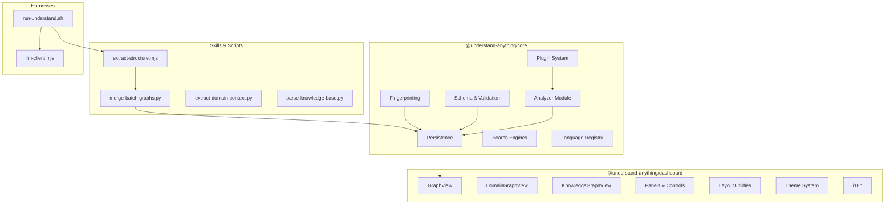

# Components

## Component Map

## Core Engine (`packages/core/src/`)

### Plugin System

| File | Responsibility |
|------|---------------|
| `plugins/registry.ts` | `PluginRegistry` — registers plugins by language, dispatches `analyzeFile`/`resolveImports`/`extractCallGraph` |
| `plugins/tree-sitter-plugin.ts` | `TreeSitterPlugin` — initializes WASM parsers, delegates to language-specific extractors |
| `plugins/discovery.ts` | Serializes/deserializes plugin configuration |

### Language Extractors (`plugins/extractors/`)

Each extractor implements `AnalyzerPlugin` and uses tree-sitter AST queries to extract functions, classes, imports, exports, and call graphs.

| Extractor | Language | Key Patterns |
|-----------|----------|-------------|
| `TypeScriptExtractor` | TS/JS | ES modules, classes, arrow functions, type exports |
| `PythonExtractor` | Python | Decorators, `from` imports, class inheritance |
| `GoExtractor` | Go | Receiver methods, interfaces, struct types |
| `RustExtractor` | Rust | Traits, impls, enums, use declarations |
| `JavaExtractor` | Java | Packages, annotations, interfaces, generics |
| `CSharpExtractor` | C# | Namespaces, properties, LINQ patterns |
| `CppExtractor` | C/C++ | Headers, templates, namespaces |
| `RubyExtractor` | Ruby | Modules, mixins, attr_accessor |
| `PhpExtractor` | PHP | Namespaces, use declarations, interfaces |

### Non-code Parsers (`plugins/parsers/`)

Handle config and infrastructure files that don't have tree-sitter grammars:

`DockerfileParser`, `MakefileParser`, `YAMLConfigParser`, `JSONConfigParser`, `TerraformParser`, `ProtobufParser`, `GraphQLParser`, `SQLParser`, `ShellParser`, `MarkdownParser`, `TOMLParser`, `EnvParser`

### Analyzer Module (`analyzer/`)

| File | Responsibility |
|------|---------------|
| `graph-builder.ts` | `GraphBuilder` — constructs nodes/edges from structural analysis results |
| `normalize-graph.ts` | Normalizes batch LLM output (node IDs, types, complexity) |
| `layer-detector.ts` | Classifies nodes into architectural layers (API, Service, Data, UI, Utility) |
| `tour-generator.ts` | Generates guided learning tours (heuristic or LLM-based) |
| `llm-analyzer.ts` | Builds prompts for file analysis and project summaries |
| `language-lesson.ts` | Detects programming patterns and generates explanations |

### Schema & Validation (`schema.ts`)

Zod-based validation of the `KnowledgeGraph` structure. Provides `validateGraph`, `normalizeGraph`, `autoFixGraph`, and `sanitizeGraph` functions. Ensures referential integrity (edges reference existing nodes).

### Search (`search.ts`, `embedding-search.ts`)

- **Fuzzy search** — Fuse.js over node names/summaries
- **Semantic search** — cosine similarity over embeddings (when available)

### Fingerprinting (`fingerprint.ts`, `staleness.ts`)

Content-hash based change detection. `buildFingerprintStore` creates hashes; `isStale` compares against stored fingerprints; `mergeGraphUpdate` patches the graph incrementally.

### Persistence (`persistence/`)

File I/O for graph, fingerprints, config, and metadata. Reads/writes to `.understand-anything/` directory.

### Language & Framework Registries (`languages/`)

Static registries mapping file extensions to language configs and detecting frameworks (React, Django, Spring, etc.) from project markers.

## Dashboard (`packages/dashboard/`)

### Graph Views

| Component | Purpose |
|-----------|---------|
| `GraphView.tsx` | Main structural graph — layer overview + detail drill-down |
| `DomainGraphView.tsx` | Business domain visualization (domains → flows → steps) |
| `KnowledgeGraphView.tsx` | Wiki/knowledge base force-directed graph |

### Panels & Controls

| Component | Purpose |
|-----------|---------|
| `NodeInfo.tsx` | Selected node details, relationships, code preview |
| `FilterPanel.tsx` | Edge type and complexity filters |
| `SearchBar.tsx` | Fuzzy + semantic search input |
| `LearnPanel.tsx` | Guided tour navigation |
| `FileExplorer.tsx` | File tree with graph node mapping |
| `CodeViewer.tsx` | Syntax-highlighted source code display |
| `PathFinderModal.tsx` | Find shortest path between two nodes |
| `ExportMenu.tsx` | Export graph as SVG/PNG/JSON |

### Layout Utilities (`utils/`)

| File | Purpose |
|------|---------|
| `elk-layout.ts` | ELK.js hierarchical layout (primary) |
| `layout.ts` | Dagre and d3-force fallback layouts |
| `containers.ts` | Derive container groupings from folder structure |
| `edgeAggregation.ts` | Aggregate edges between layers/containers |
| `filters.ts` | Node/edge filtering logic |
| `louvain.ts` | Community detection for knowledge graphs |

### State Management (`store.ts`)

Single Zustand store managing: selected node, active tour step, graph indexes, filter state, layer navigation, search results.

### Theme System (`themes/`)

CSS custom property-based theming with presets. `ThemeProvider` context, `applyTheme` engine, accent color derivation.

### i18n (`locales/`)

6 locales (en, zh, zh-TW, ja, ko, ru). `getLocale` resolves from URL param or browser preference.

## Skills & Scripts

### Pipeline Scripts (`skills/understand/`)

| Script | Purpose |
|--------|---------|
| `merge-batch-graphs.py` | Central merge: deduplicates nodes, normalizes edges, links tests to production files, canonicalizes direction |
| `extract-structure.mjs` | Runs tree-sitter extraction, outputs batch JSON fragments |
| `build-fingerprints.mjs` | Generates content hashes for incremental detection |
| `merge-subdomain-graphs.py` | Merges domain sub-graphs into unified domain graph |

### Domain Analysis (`skills/understand-domain/`)

`extract-domain-context.py` — scans file tree, detects entry points, extracts metadata for LLM domain analysis.

### Knowledge Base (`skills/understand-knowledge/`)

| Script | Purpose |
|--------|---------|
| `parse-knowledge-base.py` | Parses Karpathy-pattern wikis: extracts wikilinks, headings, frontmatter, categories |
| `merge-knowledge-graph.py` | Merges LLM-discovered relationships with deterministic parse results |

## Harnesses

### Kiro Harness (`harnesses/kiro/run-understand.sh`)

Bash orchestrator that runs the full pipeline standalone. Handles argument parsing, environment setup, calls `extract-structure.mjs`, optionally invokes LLM via `llm-client.mjs`, then runs `merge-batch-graphs.py`.

### LiteLLM Client (`harnesses/litellm/llm-client.mjs`)

Node.js module that reads prompts from stdin, calls an OpenAI-compatible endpoint, and writes responses to stdout. Supports configurable base URL, API key, and model via environment variables.
