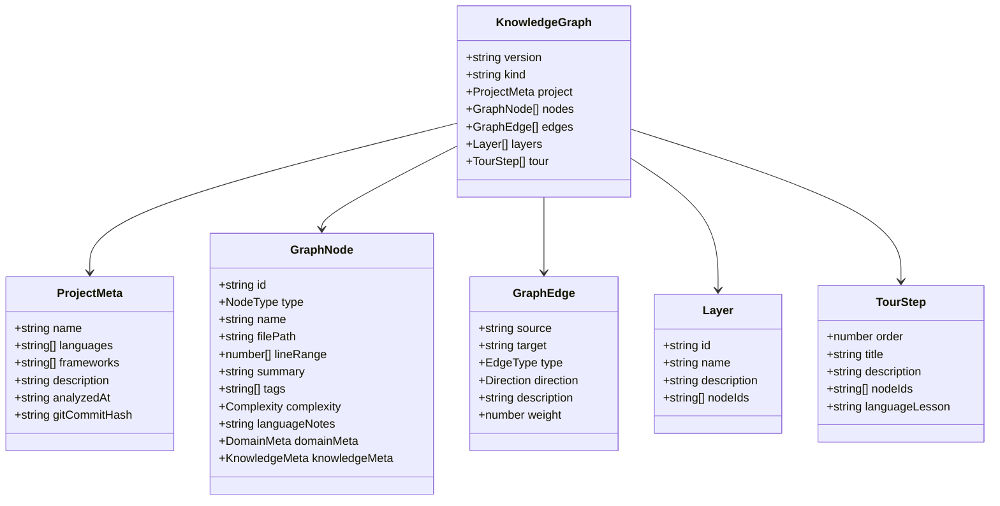

# Data Models

## Knowledge Graph (Root Schema)

The entire system revolves around a single JSON structure persisted at `.understand-anything/knowledge-graph.json`:

```typescript
interface KnowledgeGraph {
  version: string;
  kind?: "codebase" | "knowledge";
  project: ProjectMeta;
  nodes: GraphNode[];
  edges: GraphEdge[];
  layers: Layer[];
  tour: TourStep[];
}
```



## Node Types (21 total)

Organized into 4 categories:

| Category | Types | Purpose |
|----------|-------|---------|
| Code (5) | `file`, `function`, `class`, `module`, `concept` | Source code entities |
| Non-code (8) | `config`, `document`, `service`, `table`, `endpoint`, `pipeline`, `schema`, `resource` | Infrastructure and config |
| Domain (3) | `domain`, `flow`, `step` | Business process modeling |
| Knowledge (5) | `article`, `entity`, `topic`, `claim`, `source` | Wiki/knowledge base entities |

## Edge Types (35 total)

Organized into 8 categories:

| Category | Types |
|----------|-------|
| Structural | `imports`, `exports`, `contains`, `inherits`, `implements` |
| Behavioral | `calls`, `subscribes`, `publishes`, `middleware` |
| Data flow | `reads_from`, `writes_to`, `transforms`, `validates` |
| Dependencies | `depends_on`, `tested_by`, `configures` |
| Semantic | `related`, `similar_to` |
| Infrastructure | `deploys`, `serves`, `provisions`, `triggers` |
| Schema/Data | `migrates`, `documents`, `routes`, `defines_schema` |
| Domain | `contains_flow`, `flow_step`, `cross_domain` |
| Knowledge | `cites`, `contradicts`, `builds_on`, `exemplifies`, `categorized_under`, `authored_by` |

## Edge Properties

```typescript
interface GraphEdge {
  source: string;      // Node ID
  target: string;      // Node ID
  type: EdgeType;      // One of 35 types
  direction: "forward" | "backward" | "bidirectional";
  description?: string;
  weight: number;      // 0.0 to 1.0 (strength/confidence)
}
```

The `direction` field is canonicalized during merge — `merge-batch-graphs.py` ensures all edges point "forward" (source → target) and swaps inverted edges.

## Node Complexity

Every node has a complexity classification:

```typescript
type Complexity = "simple" | "moderate" | "complex";
```

Normalized during merge based on function count, nesting depth, and cyclomatic indicators.

## Domain Metadata

Attached to `domain`, `flow`, and `step` nodes:

```typescript
interface DomainMeta {
  entities?: string[];
  businessRules?: string[];
  crossDomainInteractions?: string[];
  entryPoint?: string;
  entryType?: "http" | "cli" | "event" | "cron" | "manual";
}
```

## Knowledge Metadata

Attached to `article`, `entity`, `topic`, `claim`, and `source` nodes:

```typescript
interface KnowledgeMeta {
  wikilinks?: string[];
  backlinks?: string[];
  category?: string;
  content?: string;
}
```

## Persistence Format

All data stored in `.understand-anything/`:

| File | Content |
|------|---------|
| `knowledge-graph.json` | Full `KnowledgeGraph` |
| `domain-graph.json` | Domain-specific `KnowledgeGraph` (kind: "codebase") |
| `fingerprints.json` | `Record<filePath, contentHash>` |
| `meta.json` | `AnalysisMeta` (timestamps, version, file count) |
| `config.json` | `ProjectConfig` (autoUpdate, outputLanguage) |
| `intermediate/` | Batch fragments (not committed) |
| `diff-overlay.json` | Diff impact data (not committed) |

## Analysis Metadata

```typescript
interface AnalysisMeta {
  lastAnalyzedAt: string;   // ISO timestamp
  gitCommitHash: string;
  version: string;
  analyzedFiles: number;
  theme?: ThemeConfig;
}

interface ProjectConfig {
  autoUpdate: boolean;
  outputLanguage?: string;  // "en", "zh", "ja", "ko", "ru"
}
```

## Non-code Structural Sub-types

Used by parsers to represent config file internals:

```typescript
interface SectionInfo { name: string; level: number; lineRange: [number, number]; }
interface DefinitionInfo { name: string; kind: string; lineRange: [number, number]; fields: string[]; }
interface ServiceInfo { name: string; image?: string; ports: number[]; lineRange?: [number, number]; }
interface EndpointInfo { method?: string; path: string; lineRange: [number, number]; }
interface StepInfo { name: string; lineRange: [number, number]; }
interface ResourceInfo { name: string; kind: string; lineRange: [number, number]; }
interface ReferenceResolution { source: string; target: string; referenceType: string; line?: number; }
```
