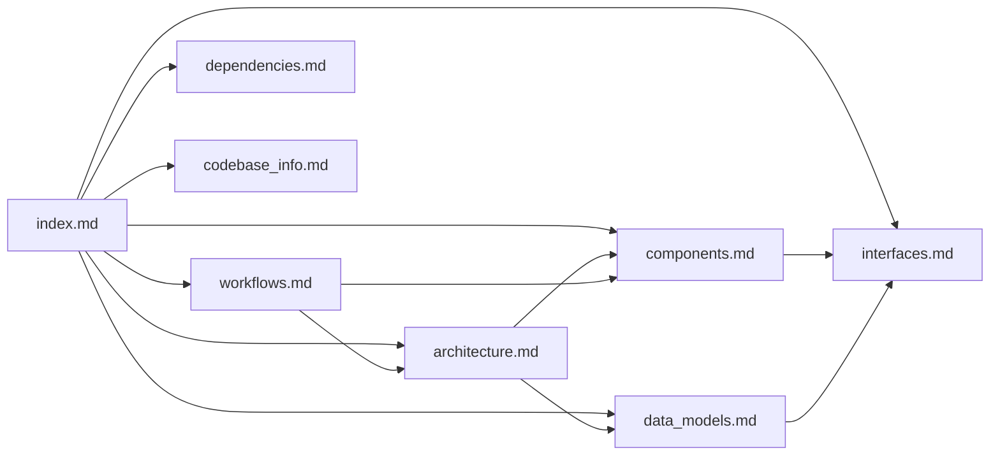

# Knowledge Base Index

> **For AI Assistants:** This file is the primary entry point for understanding the Understand-Anything codebase. Read this file first to determine which detailed documentation files to consult for specific questions.

## How to Use This Documentation

1. **Start here** — this index contains summaries of every documentation file
2. **Consult specific files** — based on the summaries below, read the relevant detailed file
3. **Cross-reference** — files link to each other; follow references for deeper context

## Document Map

| File | Purpose | Consult When... |
|------|---------|-----------------|
| [codebase_info.md](codebase_info.md) | Project metadata, tech stack, workspace layout | You need to know what technologies are used, how packages are organized, or what commands are available |
| [architecture.md](architecture.md) | System architecture, design patterns, data flow | You need to understand how components interact, the pipeline stages, or the plugin system design |
| [components.md](components.md) | Major components and their responsibilities | You need to find where specific functionality lives or understand a component's API |
| [interfaces.md](interfaces.md) | TypeScript interfaces, plugin contracts, APIs | You need type definitions, plugin interface contracts, or API shapes |
| [data_models.md](data_models.md) | Graph schema, node/edge types, persistence format | You need to understand the knowledge graph structure or modify graph data |
| [workflows.md](workflows.md) | Pipeline execution, build processes, CI/CD | You need to understand how the analysis pipeline runs or how to add new pipeline stages |
| [dependencies.md](dependencies.md) | External dependencies and their roles | You need to understand why a dependency exists or find alternatives |

## Architecture at a Glance

The system is a **multi-agent pipeline** that:
1. Scans a project's file tree
2. Extracts structure via tree-sitter AST parsing (10 languages)
3. Enriches with LLM-generated summaries, layers, and tours
4. Merges and normalizes into a unified knowledge graph (JSON)
5. Serves an interactive React dashboard for exploration

Key architectural decisions:
- **Monorepo** with pnpm workspaces (core, dashboard, skill packages)
- **Plugin system** for language extractors (tree-sitter based)
- **Provider-agnostic LLM** via LiteLLM proxy (supports OpenAI, local models, Ollama)
- **Incremental updates** via file fingerprinting (content hashes)
- **Multi-platform** via harnesses (Kiro, Claude Code, Codex, Gemini, etc.)

## Key Subsystems

### Core Analysis Engine (`packages/core/`)
The deterministic backbone: tree-sitter extraction, graph building, schema validation, search indexing, fingerprinting for incremental updates. No LLM dependency.

### Dashboard (`packages/dashboard/`)
React SPA with three graph views (structural, domain, knowledge), theming, i18n, persona-adaptive UI. Uses ReactFlow for rendering, ELK/Dagre for layout.

### Skills (`skills/`)
Agent prompt definitions that orchestrate the pipeline. The main `/understand` skill coordinates 5 agents. Python scripts handle graph merging and normalization.

### Harnesses (`harnesses/`)
Standalone execution adapters that run the pipeline outside Claude Code. The Kiro harness is a bash script; LiteLLM client is a Node.js module.

### Plugin Glue (`understand-anything-plugin/src/`)
Skill implementations for chat, diff, explain, and onboard features that consume the generated knowledge graph.

## Relationships Between Documents

## Quick Answers

- **"Where does X language get parsed?"** → `packages/core/src/plugins/extractors/{language}-extractor.ts`
- **"How do I add a new language?"** → See [components.md](components.md) § Plugin System
- **"What's the graph schema?"** → See [data_models.md](data_models.md) § KnowledgeGraph
- **"How does the pipeline run?"** → See [workflows.md](workflows.md) § Analysis Pipeline
- **"How do harnesses work?"** → See [architecture.md](architecture.md) § Harness Layer
- **"What does the dashboard render?"** → See [components.md](components.md) § Dashboard
