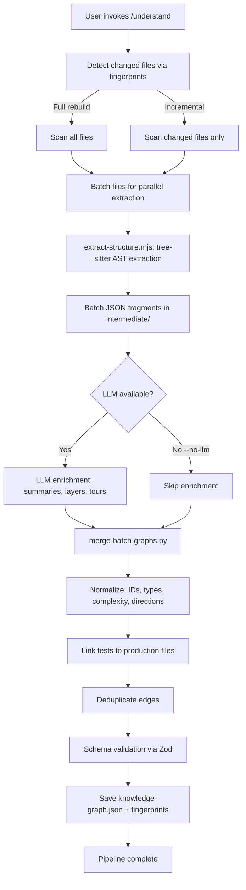
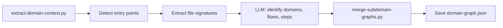
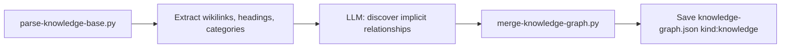
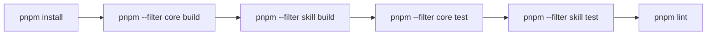
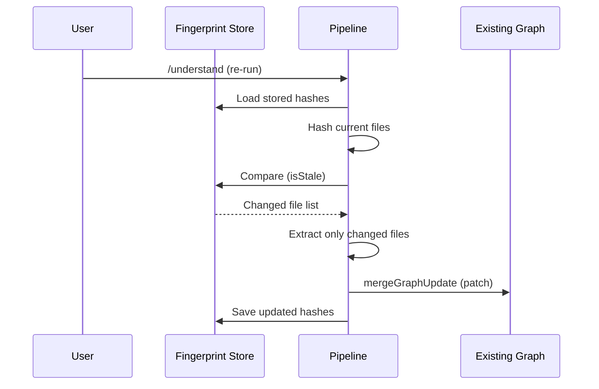

# Workflows

## Analysis Pipeline (`/understand`)

The primary workflow that transforms a codebase into a knowledge graph:



### Pipeline Stages in Detail

1. **Fingerprint check** — compare stored content hashes against current files to determine what changed
2. **File discovery** — walk project tree, apply `.understandignore` filters
3. **Batch extraction** — `extract-structure.mjs` runs tree-sitter on batches of 20-30 files (up to 5 concurrent)
4. **LLM enrichment** (optional) — generate summaries, detect layers, build tours
5. **Merge** — `merge-batch-graphs.py` combines all fragments into a single graph
6. **Normalization** — canonicalize node IDs, fix types, normalize complexity
7. **Test linking** — heuristically match test files to production files, add `tested_by` edges
8. **Edge deduplication** — remove duplicate/inverted edges, keep highest weight
9. **Validation** — Zod schema check, auto-fix minor issues
10. **Persistence** — write to `.understand-anything/`

## Domain Analysis (`/understand-domain`)



## Knowledge Base Analysis (`/understand-knowledge`)



## Dashboard Workflow

```mermaid
flowchart TD
    LAUNCH[/understand-dashboard] --> VITE[Start Vite dev server]
    VITE --> FIND[Find knowledge-graph.json]
    FIND --> SERVE[Serve graph via /__graph endpoint]
    SERVE --> LOAD[Dashboard loads graph]
    LOAD --> INDEX[Build search indexes]
    INDEX --> LAYOUT[Compute ELK layout]
    LAYOUT --> RENDER[Render ReactFlow graph]
    RENDER --> INTERACT[User interaction: click, search, filter, tour]
```

## Build & Test Workflow



### CI Pipeline (GitHub Actions)

Triggered on pull requests:
1. Checkout → pnpm setup → Node 22
2. `pnpm install` (cached)
3. Build core → Build skill
4. Test core → Test skill

## Incremental Update Workflow



## Harness Execution Modes

The Kiro harness (`run-understand.sh`) supports multiple execution modes:

| Mode | Flag | LLM Backend |
|------|------|-------------|
| Full (with LLM) | (default) | LiteLLM proxy → any OpenAI-compatible API |
| No LLM | `--no-llm` | None — structure-only graph |
| Local (LM Studio) | `--local` | localhost:1234 |
| Ollama | `--ollama [model]` | localhost:11434 |
| Full rebuild | `--full` | Forces re-analysis of all files |

## Adding a New Language (Extension Workflow)

1. Create `packages/core/src/plugins/extractors/{lang}-extractor.ts` implementing `AnalyzerPlugin`
2. Add tree-sitter grammar dependency to `packages/core/package.json`
3. Register in `packages/core/src/plugins/extractors/index.ts`
4. Add language config in `packages/core/src/languages/configs/{lang}.ts`
5. Register config in `packages/core/src/languages/configs/index.ts`
6. Add tests in `packages/core/src/plugins/extractors/__tests__/{lang}-extractor.test.ts`
7. Add grammar to `pnpm.onlyBuiltDependencies` in root `package.json`
